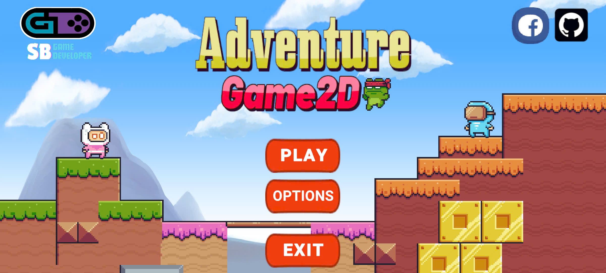
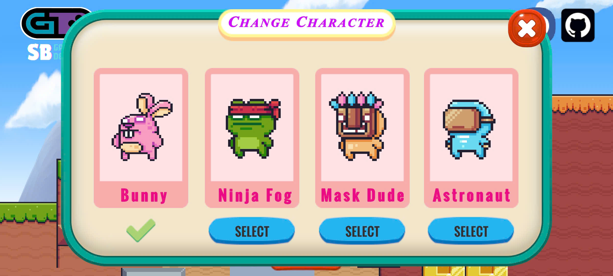
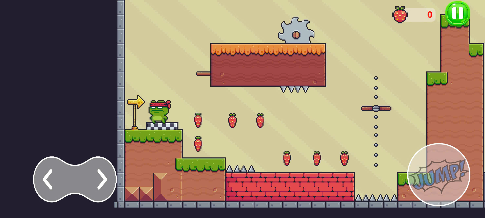
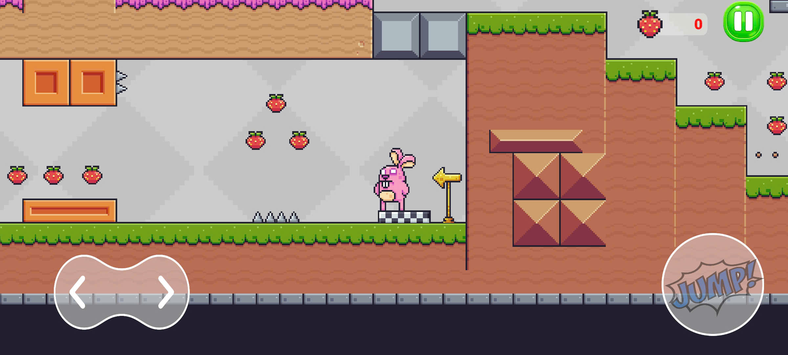
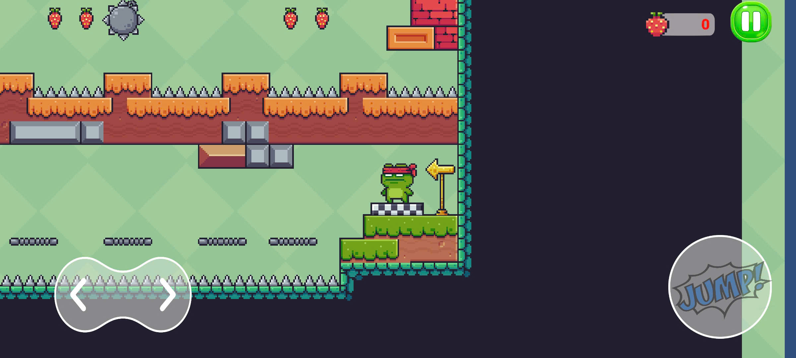
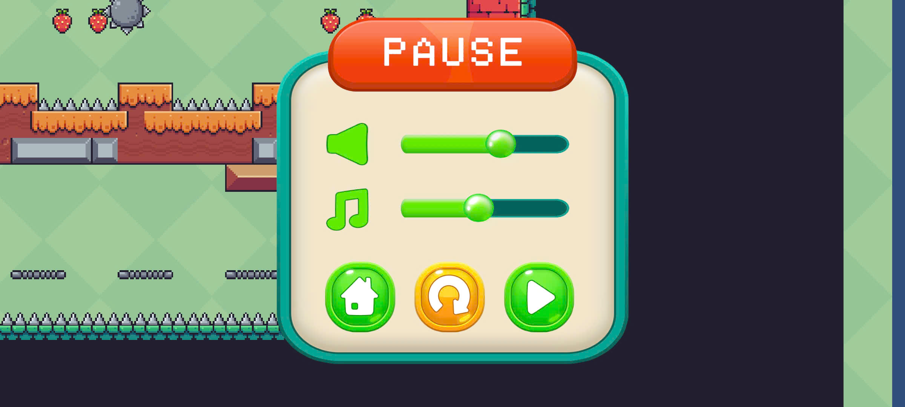

# 🎮 Adventure2D

🚀 Trong Adventure, người chơi điều khiển nhân vật di chuyển đến đích, vượt qua địa hình, enemy và hoàn các chướng ngoại vật trên đường, sự dụng checkpoint để lưu lại điểm hồi sinh. Game cho phép thay đổi 1 vài nhân vật, cài đặt âm thanh. Các màn chơi có độ khó tăng dần. 

🚀 Game mang phong cách nhẹ nhàng, thư giãn. Là dự án đầu tay trong quá trình em tìm hiểu về unity. 

---
## 📖 Mô Tả

- **Thể loại**: 2D, platformer, Mobile
- **Công cụ**: Unity (phiên bản 2022.3.58f1), Visual Studio 2022, Adobe Photoshop  
- **Mục tiêu**: Hoàn thành trò chơi đầy đủ các tính năng chính như giao diện trang chủ, chọn màn chơi, reload, pause, thay đổi nhân vật ... Tối ưu hệ thống gameplay mượt mà, mâng lại trải nghiệm tốt cho người chơi. Phục vụ cho việc làm dự án cá nhân để giới thiệu kĩ năng của bản thân cũng nhữ các định hướng khác trong tương lai. 

---
## 🔧 Tính năng:

- ✔️ Hệ thống điều khiển đơn giản, phù hợp với nhiều đối tượng. 
  
- ✔️ Checkpoint lưu lại vị trí của người chơi qua các gia đoạn. 

- ✔️ Cho phép thay đổi nhân vật mang lại tính đa dạng. 

- ✔️ Độ khó phù hợp tăng dầng theo cấp dộ. 

- ✔️ Hệ thống âm thanh sử dụng AutoMixer, chỉnh sửa trong cài đặt. 

- ✔️ Thiết kế mã nguồn theo nguyên tắc opp. 

- ✔️ Sử dụng LeanTwean và Dotwen cho việc animation các hiệu ứng Ui. 

- ✔️ ...

---

## 📸 Demo

  
  
  

  
  
   
  
  
  <i>📂 Link video demo chi tiết và apk: https://drive.google.com/drive/folders/1bkWjf9oHGOFDm_2E5xxP8d3A1yIF9JDl?usp=sharing </i>

---

## 🕹️ Yêu Cầu & Cài Đặt (Requirements & Setup)
1, Tải và cài đặt Unity 2022.3.58f1 LTS hoặc cao hơn

2, Clone dự án: git clone https://github.com/NguyennBinhh/Adventure2D_Mobile.git

3, Mở dự án qua Unity Hub

4, Nhấn Play để chạy thử trong Editor

---

## 🛣️ Roadmap
✅ Cơ bản Platformer hoạt động

✅ Hệ thống âm thanh

✅ Thay đổi nhân vật của người chơi

✅ Menu chọn level

✅ Độ khó tăng theo level

✅ Hoạt ảnh xuất hiện của Ui

---

## 👥 Credits

Code, thiết kế và triển khai bởi Nguyễn Bá Bình.

